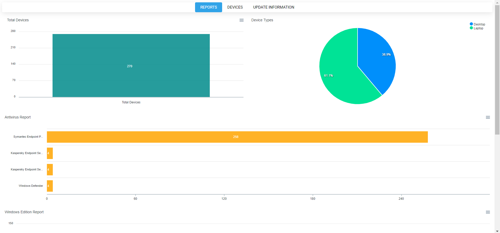

<h3 align="center">PS-Inventory</h3>

<div align="center">

[](LICENSE)

</div>

## Disclaimer
This script is merely a proof of concept. There is already software out in the wild that handles inventory much better. I am not at a comfortable point working with databases in PowerShell, which is why I chose the JSON file storage method.

## Demo



- Windows Edition/Windows Build charts not shown in image.
- Devices page shows device information in a table with exports to Excel,PDF,CSV.
- Build Update tab shows a calendar of when each Windows 10 device received its build upate (i.e. updating from 1903/1909). Windows 7/8 devices will show date of OS installation.

## About
Fetch computer information and output to respective JSON file. Afterwards, build a reporting dashboard with PSWriteHTML.

## Getting Started
Since this is a small script, a simple `git clone` will get you a copy of the script up and running on your local machine for development and testing purposes.

This script relies on the
[ActiveDirectory](https://docs.microsoft.com/en-us/powershell/module/addsadministration/?view=win10-ps)
and
[PSWriteHTML](https://github.com/EvotecIT/PSWriteHTML)
modules.

```ps
Import-Module ActiveDirectory
Import-Module PSWriteHTML
```

It is also advantageous to install the RSAT tools for Active Directory.

```ps
Get-WindowsCapability -Name RSAT* -Online | Add-WindowsCapability -Online
```

## Usage

To start, run `.\PS-Inventory.ps1`. The text based menu will help you with the rest.

Once you have at least one computer scanned, run the `Build-Report.ps1` script. This will generate a report called `Report.html` in the script root. You can send this report to whoever via one single file.

If you want to modify the report builder, open the file and change a few configuration variables at the top (mainly for colors and ignoring some warnings).

Enjoy!

### Getting Help
The `Help` parameter will get you started on how the script behaves.

```ps
.\PS-Inventory.ps1 -Help
```

## Future Implementations

- [x] Scan all computers in a specified OU
- [ ] Add report building into main script with parameter
- [ ] Add custom options for other devices (printers, APs, etc) accessed through CSVs and shown in reporting
- [ ] Add global config file for AD configuration

## Resources

|   |
|---|
| [Parameters](https://docs.microsoft.com/en-us/powershell/module/microsoft.powershell.core/about/about_functions_advanced_parameters?view=powershell-6) |
| [PSWriteHTML](https://github.com/EvotecIT/PSWriteHTML) |
| [ActiveDirectory](https://docs.microsoft.com/en-us/powershell/module/addsadministration/?view=win10-ps) |
